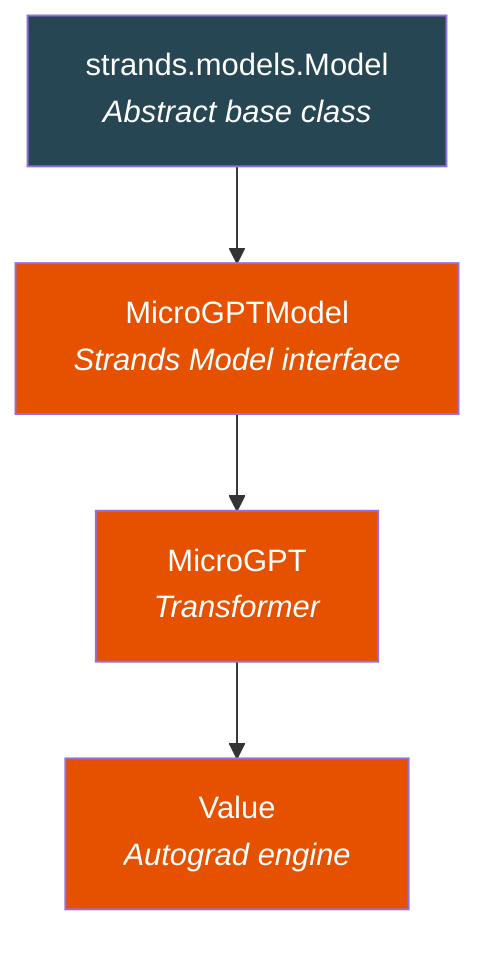
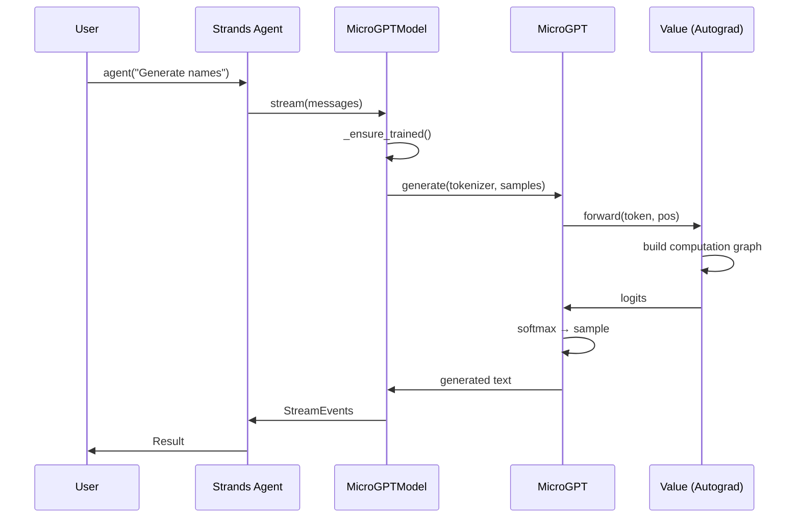
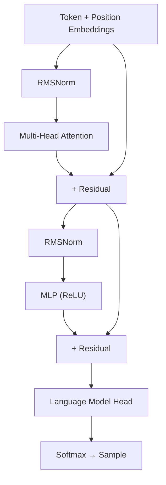
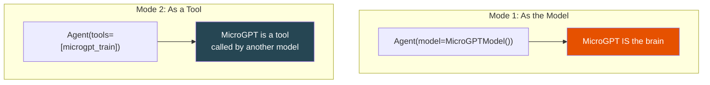

# Architecture

How strands-microgpt is structured internally.

---

## Package Structure

```
strands_microgpt/
├── __init__.py              # Exports: Value, MicroGPT, Tokenizer, MicroGPTModel, tools
├── engine.py                # Core: Value (autograd), Tokenizer, MicroGPT (transformer)
├── microgpt_model.py        # Strands Model interface
└── tools/
    ├── __init__.py           # Tool exports
    ├── microgpt_train.py     # Training tool (@tool decorated)
    └── microgpt_generate.py  # Generation tool (@tool decorated)
```

## Component Hierarchy



## Data Flow



## The Transformer

GPT-2 architecture (simplified):

- **Embeddings** — token + position
- **RMSNorm** — root mean square normalization (no LayerNorm)
- **Multi-Head Attention** — Q, K, V projections + causal mask
- **MLP** — 2-layer feedforward with ReLU
- **Residual connections** — add input to output
- **No biases** — weights only



## Two Usage Modes


