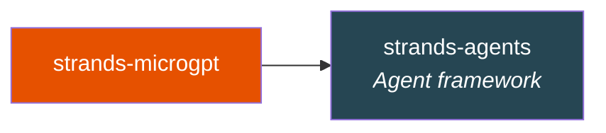

# Installation

## Requirements

- Python ≥ 3.10
- `strands-agents` (installed automatically)
- **No GPU needed.** No PyTorch. No CUDA. Pure Python.

## Install

```bash
pip install strands-microgpt
```

!!! note "That's it"
    Unlike most ML packages, there's nothing else to install. The entire algorithm runs in pure Python.

## Verify

```python
from strands_microgpt import Value, MicroGPT, Tokenizer
print("✅ strands-microgpt installed successfully")
```

## What Gets Installed



That's the entire dependency tree. The engine itself (`Value`, `MicroGPT`, `Tokenizer`) uses only Python stdlib.

## Development Install

```bash
git clone https://github.com/cagataycali/strands-microgpt.git
cd strands-microgpt
pip install -e ".[dev]"
pytest -v
```

## What's Next

- [**Quickstart**](quickstart.md) — Train your first GPT in 3 lines
- [**Autograd Engine**](../guide/autograd.md) — Understand backpropagation from scratch
- [**Examples**](../examples/overview.md) — Code samples for every use case
