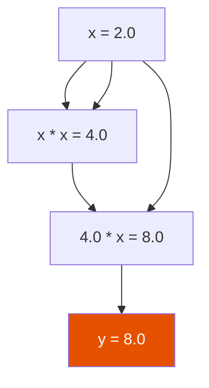

# Autograd Engine

The `Value` class implements scalar-valued automatic differentiation. It's the foundation everything else is built on.

---

## How It Works

Every `Value` stores:
- `data` — the scalar value
- `grad` — the gradient (computed by `.backward()`)
- `_children` — parent nodes in the computation graph
- `_local_grads` — local partial derivatives

When you do math with `Value` objects, you build a directed acyclic graph. Calling `.backward()` on the output traverses this graph in reverse (topological sort) and applies the chain rule.

---

## Operations

```python
from strands_microgpt import Value

a = Value(2.0)
b = Value(3.0)

# Arithmetic
c = a + b       # 5.0
d = a * b       # 6.0
e = a - b       # -1.0
f = a / b       # 0.667
g = a ** 2      # 4.0

# Activations
h = a.relu()    # max(0, a) = 2.0
i = a.exp()     # e^2 = 7.389
j = a.log()     # ln(2) = 0.693
```

---

## Backpropagation

```python
x = Value(2.0)
y = x * x * x  # x³ = 8
y.backward()
print(x.grad)  # 12.0 (dy/dx = 3x² = 12)
```



---

## Softmax (Built from Primitives)

```python
logits = [Value(1.0), Value(2.0), Value(3.0)]
max_val = max(v.data for v in logits)
exps = [(v - max_val).exp() for v in logits]
total = sum(exps)
probs = [e / total for e in exps]

# probs ≈ [0.0900, 0.2447, 0.6652]
# All fully differentiable!
```

---

## Cross-Entropy Loss

```python
# Target: class 2
target = 2
loss = -probs[target].log()
loss.backward()

# All gradients flow back through softmax → exp → arithmetic → inputs
```

This is exactly how MicroGPT computes its training loss.

→ **Next:** [Training](training.md) | [Architecture](../architecture.md)
