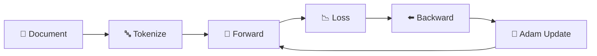

# Training

How to train MicroGPT on any text dataset.

---

## Basic Training

```python
from strands_microgpt import MicroGPT

model, tokenizer, docs = MicroGPT.from_dataset()
losses = model.train_on_docs(docs, tokenizer, num_steps=1000)

print(f"Final loss: {losses[-1]:.4f}")
```

## What Happens During Training

Each step:

1. **Pick a document** — cycle through dataset
2. **Tokenize** — BOS + chars + BOS
3. **Forward pass** — compute logits for each position
4. **Loss** — cross-entropy between predicted and actual next character
5. **Backward** — autograd computes all gradients
6. **Adam update** — update weights with adaptive learning rate



## Training Parameters

```python
losses = model.train_on_docs(
    docs,
    tokenizer,
    num_steps=1000,        # More steps = lower loss
    learning_rate=0.01,    # Linear decay to 0
    log_every=100,         # Print loss frequency
    callback=my_fn,        # Optional: callback(step, loss)
)
```

## Optimizer

Adam with:
- β₁ = 0.85, β₂ = 0.99
- ε = 1e-8
- Linear LR decay: `lr * (1 - step/total_steps)`

## Scaling Up

| Config | ~Params | Speed | Quality |
|--------|---------|-------|---------|
| `n_layer=1, n_embd=16` | 5K | Fast | Basic patterns |
| `n_layer=2, n_embd=32` | 30K | Moderate | Good names |
| `n_layer=4, n_embd=64` | 200K+ | Slow | Complex patterns |

!!! warning "Pure Python"
    This is pure Python with no vectorization. Training with large configs takes time. That's the point — you can read every line and understand exactly what's happening.

→ **Next:** [Custom Datasets](custom-datasets.md) | [Tool Usage](tool-usage.md)
