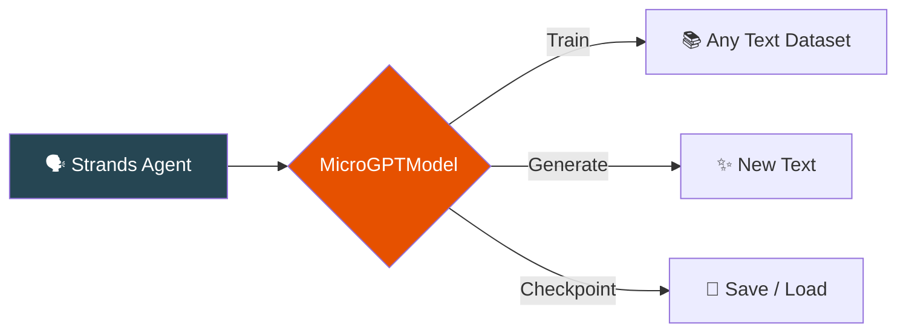

<div align="center">
  <h1>🧠 Strands MicroGPT</h1>
  <p><strong>The entire GPT algorithm in pure Python. As a Strands model provider.</strong></p>
</div>

Based on [@karpathy's atomic GPT gist](https://gist.github.com/karpathy/8627fe009c40f57531cb18360106ce95): *"The most atomic way to train and run inference for a GPT in pure, dependency-free Python. This file is the complete algorithm. Everything else is just efficiency."*

---

## What is this?

A **complete GPT implementation** — autograd engine, transformer, tokenizer, Adam optimizer, training, and inference — in **pure Python**. No PyTorch, no NumPy, no CUDA.



---

## Get Started in 3 Lines

```bash
pip install strands-microgpt
```

```python
from strands_microgpt import MicroGPT

model, tokenizer, docs = MicroGPT.from_dataset()
model.train_on_docs(docs, tokenizer, num_steps=1000)

for name in model.generate(tokenizer, num_samples=10):
    print(name)
```

→ **[Full Quickstart](getting-started/quickstart.md)** | **[Installation](getting-started/installation.md)**

---

## Three Ways to Use

=== "As a Standalone Engine"
    ```python
    from strands_microgpt import MicroGPT

    model, tok, docs = MicroGPT.from_dataset()
    model.train_on_docs(docs, tok, num_steps=1000)
    samples = model.generate(tok, num_samples=10)
    ```

=== "As a Strands Model"
    ```python
    from strands import Agent
    from strands_microgpt import MicroGPTModel

    model = MicroGPTModel(num_steps=1000)
    agent = Agent(model=model)
    agent("Generate some names")
    ```

=== "As a Tool"
    ```python
    from strands import Agent
    from strands_microgpt import microgpt_train, microgpt_generate

    agent = Agent(tools=[microgpt_train, microgpt_generate])
    agent("Train a GPT on names, then generate 10")
    ```

---

## What's Inside

<div class="grid cards" markdown>

- **⚡ Autograd Engine**

    `Value` class with full backpropagation. Build computation graphs, compute gradients automatically.

    → [Autograd Guide](guide/autograd.md)

- **🧠 GPT Transformer**

    Multi-head attention, MLP, RMSNorm, Adam optimizer. The full algorithm in ~300 lines.

    → [Architecture](architecture.md)

- **🔧 Strands Tools**

    Train and generate as tool calls from any Strands agent (Bedrock, OpenAI, etc.)

    → [Tool Usage](guide/tool-usage.md)

- **📚 Custom Datasets**

    Train on anything — names, poems, code, molecules, DNA sequences.

    → [Custom Datasets](guide/custom-datasets.md)

</div>

---

## Quick Links

<div class="grid" markdown>

[:material-download: **Installation** →](getting-started/installation.md)

[:material-rocket-launch: **Quickstart** →](getting-started/quickstart.md)

[:material-brain: **Autograd Engine** →](guide/autograd.md)

[:material-school: **Training** →](guide/training.md)

[:material-tools: **Tool Usage** →](guide/tool-usage.md)

[:material-file-tree: **Architecture** →](architecture.md)

[:material-code-tags: **API Reference** →](api-reference.md)

[:material-code-tags: **Examples** →](examples/overview.md)

</div>

---

## Resources

- [Karpathy's GPT gist](https://gist.github.com/karpathy/8627fe009c40f57531cb18360106ce95) — The original
- [micrograd](https://github.com/karpathy/micrograd) — Karpathy's autograd engine
- [makemore](https://github.com/karpathy/makemore) — Character-level language modeling
- [Strands Agents](https://strandsagents.com) — The agent framework
- [PyPI Package](https://pypi.org/project/strands-microgpt/)
